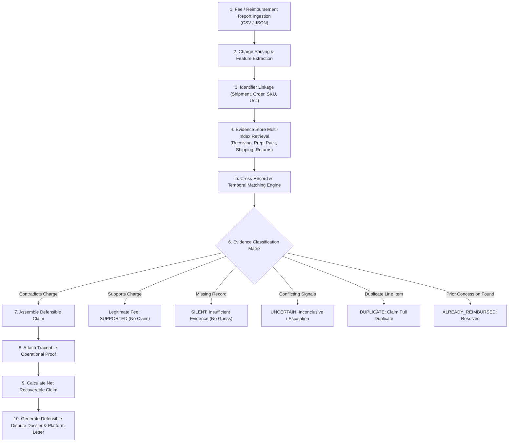

# AI Recovery Manager — Turn Evidence into Financial Recovery
**CUBE Buildathon • Track #5: Recovery Manager (RCY #5)**
*Presented by Sydon.ai x Codequesters*

---

## 📋 Table of Contents
1. [Problem Understanding](#-problem-understanding)
2. [Solution Overview](#-solution-overview)
3. [Setup Instructions](#-setup-instructions)
4. [Usage Instructions](#-usage-instructions)
5. [Assumptions & Limitations](#-assumptions--limitations)
6. [Canonical Test Scenarios & Verification](#-canonical-test-scenarios--verification)
7. [System Architecture Summary](#-system-architecture-summary)

---

## 🎯 Problem Understanding

Ecommerce operators and brand sellers receive dozens of unexpected fee adjustments, chargebacks, and penalties from platforms and 3PL fulfillment networks (e.g. Amazon FBA inbound defect fees, unplanned prep charges, barcode scannability penalties, dimensional weight variances, and damaged inventory assessments).

### The Core Dilemma:
- **Delayed Invoicing**: Fees typically appear weeks after the operational event occurred.
- **Fragmented Operational Records**: By the time a fee appears on a settlement statement, operational proof is scattered across disparate departments (Receiving dock logs, Prep bubblewrap/polybag scans, Pack conveyor scale logs, Shipping carrier manifests, and Returns grading records).
- **The Recovery Challenge**: Operators either absorb legitimate dispute opportunities due to missing evidence or risk account suspension by filing unsubstantiated or hallucinated disputes.

### Key Rules & Constraints from Specification:
- **No Image Capture / No Vision Agent**: Recovery Manager works purely with structured records, telemetry, metadata, inspection logs, and sensor timestamps.
- **Strict Anti-Hallucination Guardrail**: *Do not invent evidence.* If available records do not support a claim, the only valid conclusion is:
  > **`SILENT — insufficient evidence`**
- **Conservative Decision-Making**: *`UNCERTAIN` is a valid outcome.* When evidence is ambiguous or conflicting, the agent must not force a conclusion. Defensibility takes priority over claim volume.

---

## 💡 Solution Overview

The **AI Recovery Manager** is an autonomous evidence-to-recovery reasoning agent that ingests fee reports, resolves identifiers, queries multi-manager operational stores, and applies a strict 10-step decision pipeline:



### Key Solution Highlights:
1. **Multi-Manager Operational Evidence Store**: Ingests and indexes operational logs across Receiving, Prep, Pack, Shipping, and Returns managers.
2. **Defensible Dispute Generator**: Automatically crafts formal, copy-paste dispute filing letters for Amazon Seller Support / Carrier Claims with complete audit trails.
3. **Duplicate & Concession Reconciler**: Discovers duplicate charges on the same shipment and cross-references against past reimbursements to prevent double-claiming.
4. **Rich Dual Interface**:
   - **Modern Interactive Web Dashboard**: Dark-mode fintech UI with real-time financial KPI cards, scenario switchers, and visual evidence flow.
   - **Python CLI Tool**: Scriptable terminal runner for batch file processing and automated CI/CD benchmarks.

---

## 🛠️ Setup Instructions

### Prerequisites
- Python 3.10+ (tested on Python 3.14)
- Pip package manager
- Web browser (Chrome, Edge, Firefox)

### Installation
Clone the repository and install dependencies:
```bash
git clone <your-forked-repo-url>
cd CUBE
python -m pip install -r requirements.txt
```
*(Dependencies: `fastapi`, `uvicorn`, `pydantic`, `rich`, `pytest`)*

---

## 🚀 Usage Instructions

### 1. Launch the Interactive Web Dashboard
```bash
python server.py
```
Open **[http://127.0.0.1:8000](http://127.0.0.1:8000)** in your browser.
- **Scenario Carousel**: Click any of the 8 pre-loaded benchmark scenarios to see instant evidence matching and reasoning.
- **Evidence Audit Trail**: Click on any charge to view the timeline, operational sensor telemetry, and reasoning.
- **Copy Dispute Letter**: Click the button on any actionable charge to copy a formal dispute letter.
- **Export Dossier**: Export the complete analysis as a structured Markdown dossier.
- **Custom Ingestion**: Click "Custom Ingestion" to paste or upload custom fee reports, operational logs, and reimbursement credits.

### 2. Run Terminal CLI Benchmark
Execute all 8 benchmark scenarios and print formatted executive tables:
```bash
python cli.py run-scenarios
```

### 3. Analyze Custom Reports via CLI
```bash
python cli.py analyze \
  --fees data/sample_fees.json \
  --evidence data/sample_evidence.json \
  --reimbursements data/sample_reimbursements.json \
  --output dispute_dossier.md
```

### 4. Execute Standard Evidence Contract Requests (v1.0)
Execute any standard `agent-input` payload adhering to the CUBE Evidence Contract:
```bash
python cli.py handle-request --input request.json --output response.json
```
Or via HTTP REST:
```bash
curl -X POST http://127.0.0.1:8000/api/agent/handle \
  -H "Content-Type: application/json" \
  -d @request.json
```

### 5. Run Automated Pytest Suite
```bash
python -m pytest tests/ -v
```

---

## ⚖️ Assumptions & Limitations

### Assumptions
1. **Structured Telemetry**: Upstream managers (Receiving, Prep, Pack, Shipping, Returns) record operational activities with structured status codes (`PASS`, `FAIL`, `COMPLIANT`, `INTACT`) and timestamps.
2. **Traceable Identifiers**: Fee line items contain at least one trackable identifier (`shipment_id`, `order_id`, `sku`, or `unit_id`).
3. **Chronology**: Evidence recorded prior to carrier dispatch establishes condition at the time of fulfillment.

### Limitations
1. **Non-Vision Scope**: The system does not perform computer vision on images directly; it verifies structured image metadata, cryptographic file hashes, and inspection logs.
2. **Platform Specifics**: Formal dispute letter formats are tailored for Amazon Seller Support and major ecommerce 3PLs; carrier-specific claims (e.g. UPS/FedEx national accounts) may require customized claim forms.
3. **Offline Human Escalation**: When records are ambiguous (`UNCERTAIN`), the engine deliberately halts automated filing and flags the discrepancy for manual supervisor review.

---

## 🧪 Canonical Test Scenarios & Verification

| # | Scenario Challenge | Evidence Source | Assessment | Potential Claim | Verification |
| :-: | :--- | :--- | :---: | :---: | :---: |
| **1** | **Packaging defect fee ($38)** | Prep Manager recorded PASS with 3 photos before dispatch | `CONTRADICTED` | **$38.00** | ✅ PASS |
| **2** | **Barcode label unscannable fee ($45)** | Dock receipt recorded, but prep barcode verification absent | `UNCERTAIN` | **$0.00** | ✅ PASS |
| **3** | **Unplanned bubblewrap prep ($25)** | Zero operational records exist in system | `SILENT` | **$0.00** | ✅ PASS |
| **4** | **Packaging defect ($30) + Weight variance ($50)** | Prep Manager PASS ($30) + Pack Manager calibrated scale ($50) | `CONTRADICTED` | **$80.00** | ✅ PASS |
| **5** | **Weight surcharge ($65)** | Pack Manager DWS calibrated scale telemetry (14.2 lbs vs billed 28 lbs) | `CONTRADICTED` | **$65.00** | ✅ PASS |
| **6** | **Damaged inventory fee ($110)** | Prep Manager says PASS, but Receiving Manager reports damaged arrival | `UNCERTAIN` | **$0.00** | ✅ PASS |
| **7** | **Duplicate packaging fee ($20 x 2)** | Prep Manager evidence + duplicate billing detector | `DUPLICATE` | **$40.00** | ✅ PASS |
| **8** | **Manual prep adjustment ($40)** | Cross-checked against reimbursement report credit `RMB-9910` | `ALREADY_REIMBURSED` | **$0.00** | ✅ PASS |

---

## 🏛️ System Architecture Summary

See [ARCHITECTURE.md](file:///d:/Kaufee/projects/CUBE/ARCHITECTURE.md) for full architectural documentation, component contracts, data flow diagrams, and design decisions.
